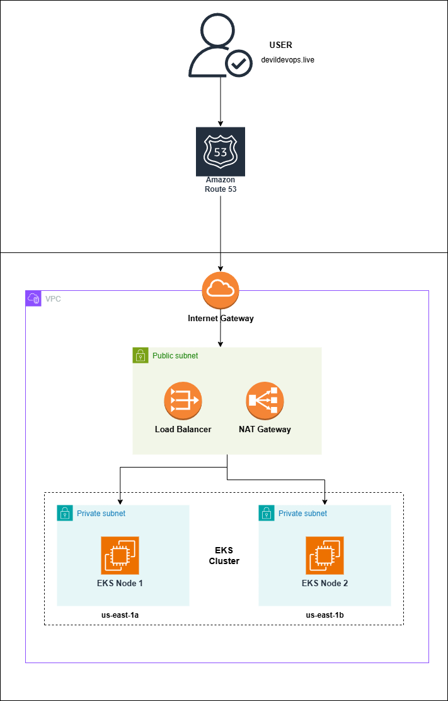
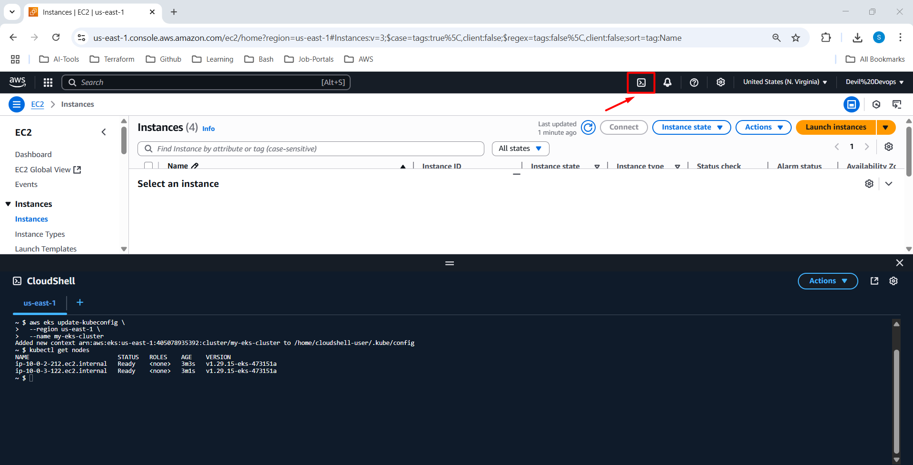
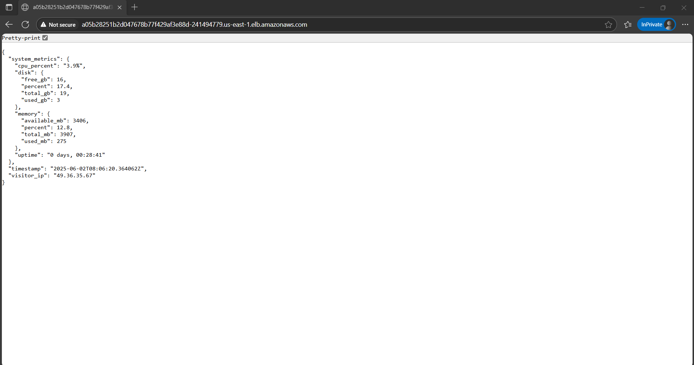
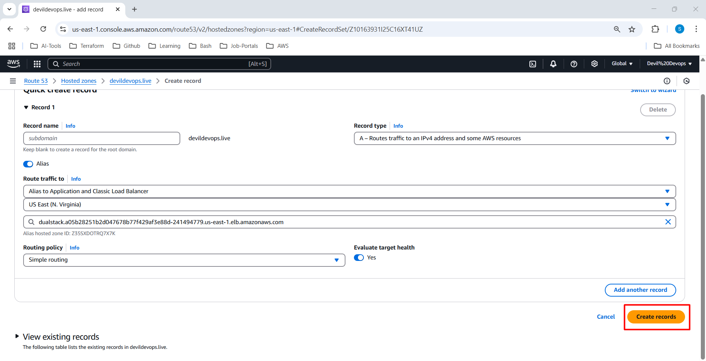
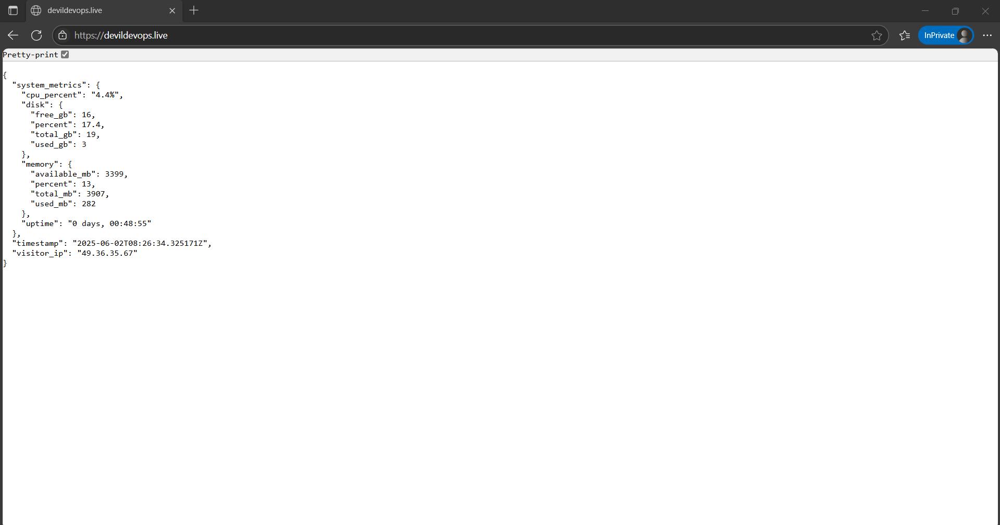
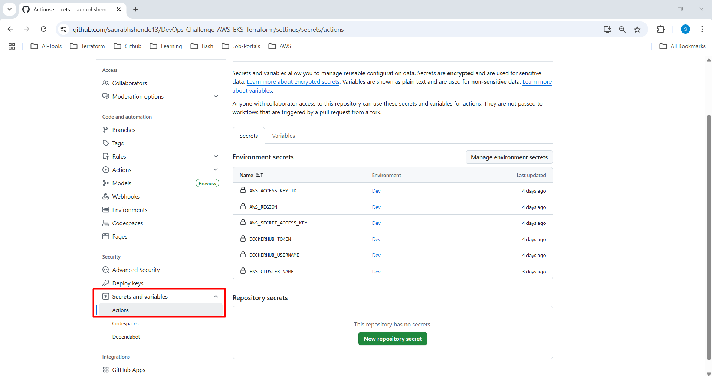
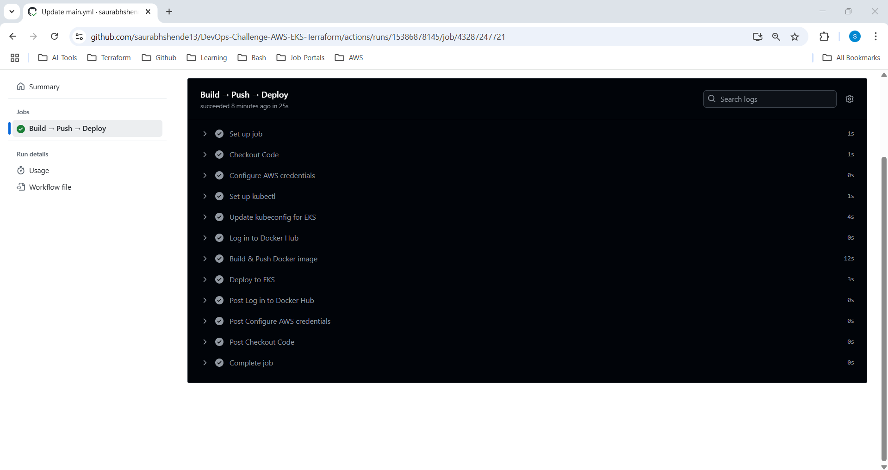

# 🚀 DevOps Challenge: Deploying a Microservice on AWS EKS using Terraform



This project demonstrates a complete DevOps workflow to provision infrastructure on AWS using Terraform, deploy a microservice to an EKS (Elastic Kubernetes Service) cluster, and automate deployments via GitHub Actions.

## 🛠️ Prerequisites

Make sure you have the following installed:

- [Terraform](https://developer.hashicorp.com/terraform/downloads)
- [AWS CLI](https://docs.aws.amazon.com/cli/latest/userguide/install-cliv2.html)
- [kubectl](https://kubernetes.io/docs/tasks/tools/)
- [Docker](https://www.docker.com/)
- An [AWS account](https://aws.amazon.com/)
- A [DockerHub account](https://hub.docker.com/)
- A registered domain in [Route 53](https://aws.amazon.com/route53/)

---

## ✅ Step 1: Create Infrastructure & EKS Cluster

```bash
git clone https://github.com/your-username/DevOps-Challenge-AWS-EKS-Terraform.git
cd DevOps-Challenge-AWS-EKS-Terraform/terraform

terraform init
terraform fmt
terraform validate
terraform plan
terraform apply
````

---

## 🌐 Step 2: Configure `kubectl` to Connect to EKS

You can use cloudshell to access kubernetes resources.

```bash
aws eks update-kubeconfig \
  --region us-east-1 \
  --name my-eks-cluster

kubectl get nodes
```

You should see the worker nodes registered and ready.



---

## 🐳 Step 3: Build and Push Docker Image

```bash
docker build -t simple-microservice .

docker tag simple-microservice:latest saurabhdocker13/simple-microservice:latest

docker push saurabhdocker13/simple-microservice:latest
```

> Replace `saurabhdocker13` with your DockerHub username if different.

---

## ☸️ Step 4: Deploy the App to EKS

```bash
cd ../k8s

kubectl apply -f deployment.yml
kubectl apply -f service.yml

# Check deployment and service status
kubectl get pods
kubectl get svc
```

> The service will expose your app via a LoadBalancer. Copy the external DNS name to access the app in the browser.

---

## 🌍 Step 5: Access App via Load Balancer

* After running `kubectl get svc`, use the `EXTERNAL-IP` of the LoadBalancer service.
* Example:
  `http://a1b2c3d4e5f6g7h8.elb.us-east-1.amazonaws.com`

  

---

## 🌐 Step 6: Create a DNS Record in Route 53

1. Go to **AWS Route 53**.
2. Open your hosted zone (e.g., `devildevops.live`).
3. Create a new record:

   * **Type**: A (Alias) or CNAME
   * **Name**: `app.devildevops.live` or any subdomain
   * **Value**: ALB DNS name from step 5
4. Save and wait for DNS propagation.



You can now access your app using your domain name.



---

## ⚙️ Step 7: Automate Deployment with GitHub Actions

1. Go to your GitHub repo → **Settings** → **Secrets and variables** → **Actions**.

2. Add the following secrets:

   * `AWS_ACCESS_KEY_ID`
   * `AWS_SECRET_ACCESS_KEY`
   * `AWS_REGION`
   * `DOCKERHUB_USERNAME`
   * `DOCKERHUB_TOKEN`
   * `EKS_CLUSTER_NAME`



3. Create the GitHub Actions workflow:

**`.github/workflows/main.yml`**

```yaml
name: Build & Deploy Simple Microservice App to EKS

on:
  push:
    branches:
      - main

env:
  IMAGE_NAME: simple-microservice
  DOCKER_REGISTRY: docker.io

jobs:
  deploy:
    name: Build → Push → Deploy
    runs-on: ubuntu-latest
    environment: Dev

    steps:
      - name: Checkout Code
        uses: actions/checkout@v3

      - name: Configure AWS credentials
        uses: aws-actions/configure-aws-credentials@v2
        with:
          aws-access-key-id: ${{ secrets.AWS_ACCESS_KEY_ID }}
          aws-secret-access-key: ${{ secrets.AWS_SECRET_ACCESS_KEY }}
          aws-region: ${{ secrets.AWS_REGION }}

      - name: Set up kubectl
        uses: azure/setup-kubectl@v3

      - name: Update kubeconfig for EKS
        run: |
          aws eks update-kubeconfig --name ${{ secrets.EKS_CLUSTER_NAME }} --region ${{ secrets.AWS_REGION }}

      - name: Log in to Docker Hub
        uses: docker/login-action@v2
        with:
          username: ${{ secrets.DOCKERHUB_USERNAME }}
          password: ${{ secrets.DOCKERHUB_TOKEN }}

      - name: Build & Push Docker image
        run: |
          docker build -t $DOCKER_REGISTRY/${{ secrets.DOCKERHUB_USERNAME }}/$IMAGE_NAME:latest .
          docker push $DOCKER_REGISTRY/${{ secrets.DOCKERHUB_USERNAME }}/$IMAGE_NAME:latest

      - name: Deploy to EKS
        run: |
          kubectl apply -f k8s/deployment.yml
          kubectl apply -f k8s/service.yml
```



---

## 🏁 Conclusion

You now have a fully functional microservice deployed to AWS EKS, with infrastructure provisioned using Terraform and continuous deployment handled via GitHub Actions. 🎉

---

## 📬 Contact

For feedback or collaboration, feel free to reach out:

* 📧 Email: [saurabhshende38@gmail.com](mailto:saurabhshende38@gmail.com)

```
